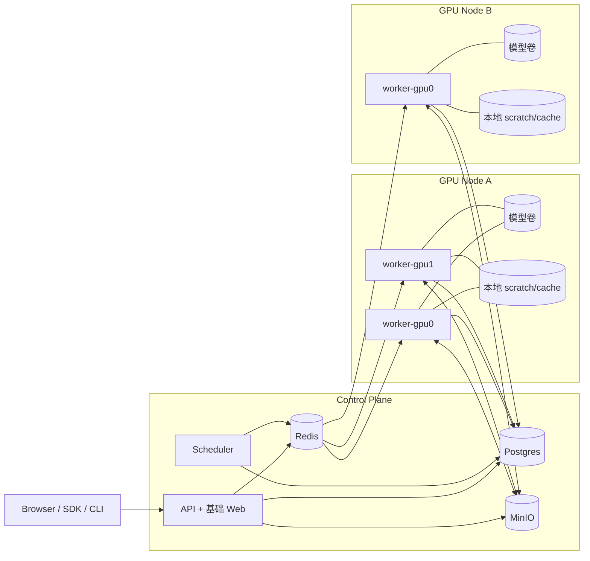

# 系统架构

## 1. 总体架构

## 2. 控制平面职责

### API + 基础 Web

- 接收上传
- 创建 job
- 创建 batch
- 查询 job/batch/worker/artifact
- 提供下载入口

### Postgres

- 元数据真源
- 保存：
  - uploads
  - jobs
  - batches
  - artifacts
  - worker heartbeats
  - assignments

### Redis

- 消息队列与事件通道
- 缓冲待执行任务
- 向 worker 下发可执行 job

当前迭代说明：

- Redis 服务已纳入本机 compose
- 当前关键调度路径仍以 `Scheduler + Postgres polling` 为主
- Redis 在本迭代中不作为唯一真源或唯一调度触发器

### MinIO

- 输入视频对象
- preprocess 输出
- `hmr4d_results.pt`
- 渲染视频
- 日志
- ZIP 包

### Scheduler

- 选择要执行的 job
- 选择空闲 worker
- 控制批次推进
- 处理重试与失败恢复

当前迭代说明：

- 调度周期固定为 `2s`
- 调度规则为 `priority DESC + created_at ASC`
- 当前只验证单实例 scheduler

## 3. 执行平面职责

### Worker

- 单 worker 绑定单 GPU
- 拉取输入视频
- 执行 `gvhmr_runner`
- 上传产物
- 更新 job 状态
- 定期上报 heartbeat

### 模型卷

- 本地只读挂载
- 存放 checkpoint 与 body models
- 不进入对象存储

### 本地 scratch/cache

- 临时工作目录
- 缓存中间文件
- 可在 worker 节点上局部复用

## 4. 单机多卡方案

- 一台机器上起多个 worker 容器
- 每个 worker 固定 `NVIDIA_VISIBLE_DEVICES=<gpu_id>`
- 每个 worker 并发度固定为 1

当前实现状态：

- 当前仓库已经验证单机单卡模式
- `worker-gpu0` 使用 mock runner 完成 `queued -> running -> succeeded`
- 后续再扩展到多 worker / 多 GPU

## 5. 多机方案

- 控制平面固定部署在一台机器
- 每台 GPU 机器只部署 worker compose
- 所有 worker 指向同一个 Postgres/Redis/MinIO

## 6. K8s 迁移边界

为了未来迁移到 K8s，必须保持以下边界稳定：

- 服务之间通过 API / queue / object storage 协作
- 控制平面与执行平面分离
- 不依赖本机 `results/` 目录作为系统真源
- worker 不直接依赖 API 容器本地文件
