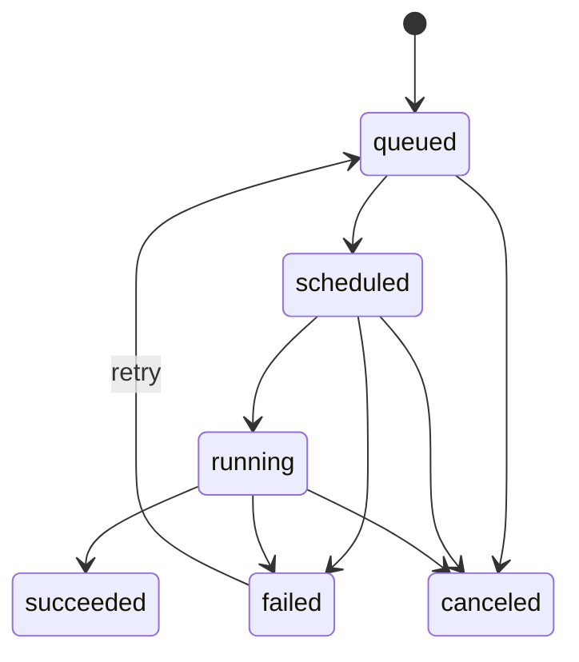
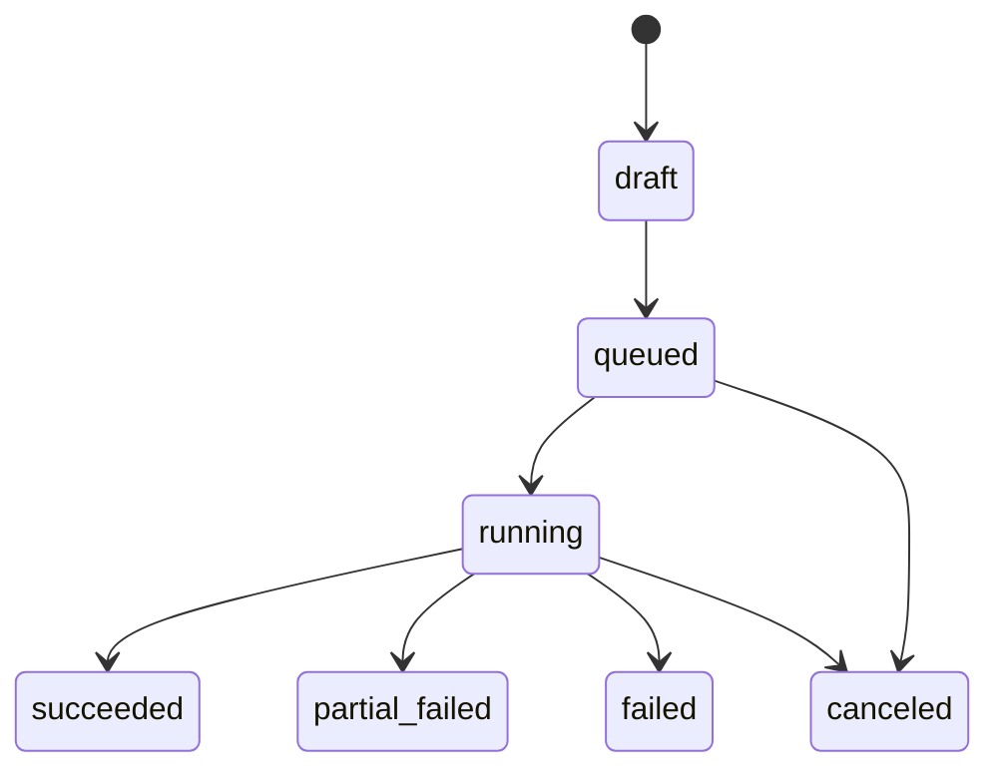

# 执行模型与状态机

## 1. Job 状态机

### 状态含义

- `queued`：已创建，等待调度
- `scheduled`：已分配 worker，等待真正开始
- `running`：worker 已占用 GPU 开始执行
- `succeeded`：执行成功，artifact 已入存储
- `failed`：执行失败
- `canceled`：被用户取消或系统终止

## 2. Batch 状态机

### Batch 判定规则

- 全部 job `queued/scheduled` 时：`queued`
- 存在 `running` 时：`running`
- 全部 `succeeded`：`succeeded`
- 全部失败或取消：`failed`
- 既有成功又有失败：`partial_failed`
- 用户整批取消：`canceled`

## 3. Worker 状态模型

- `idle`：空闲，可接新 job
- `busy`：正在执行 job
- `offline`：心跳超时

## 4. 调度规则

第一阶段固定规则：

- 先按 `priority` 排序
- 同优先级内按 `created_at` FIFO
- 只给 `idle` worker 分配 job
- 同一 worker 同时只能处理一个 job
- 同一 GPU 不允许多个并发 job

## 5. 重试规则

- worker 在 `scheduled` 或 `running` 阶段失联时，job 标记为 `failed`
- 后续可加显式重试计数
- 第一阶段不做无限重试

## 6. 取消规则

- `queued` job 可直接取消
- `scheduled` job 可取消并释放分配
- `running` job 标记为取消请求，由 worker 响应后进入 `canceled`

## 7. 缓存规则

### 核心推理缓存键

`video_sha256 + static_camera + f_mm + upstream_version`

### 渲染缓存键

`核心推理缓存键 + video_render + video_type`

### 缓存作用

- 相同视频、相同核心参数复用 preprocess 与主推理结果
- 仅更改视频渲染参数时，不重复跑核心 GVHMR 推理

## 8. 交付流程

1. 用户上传视频
2. API 创建 upload 记录并写入存储
3. API 创建 job/batch 元数据
4. Scheduler 从队列和数据库选择待执行 job
5. Scheduler 为 job 选择 worker
6. Worker 下载输入并执行 `gvhmr_runner`
7. Worker 上传 artifact 到 MinIO
8. Worker 更新 job 成功或失败状态
9. API 暴露查询与下载接口

